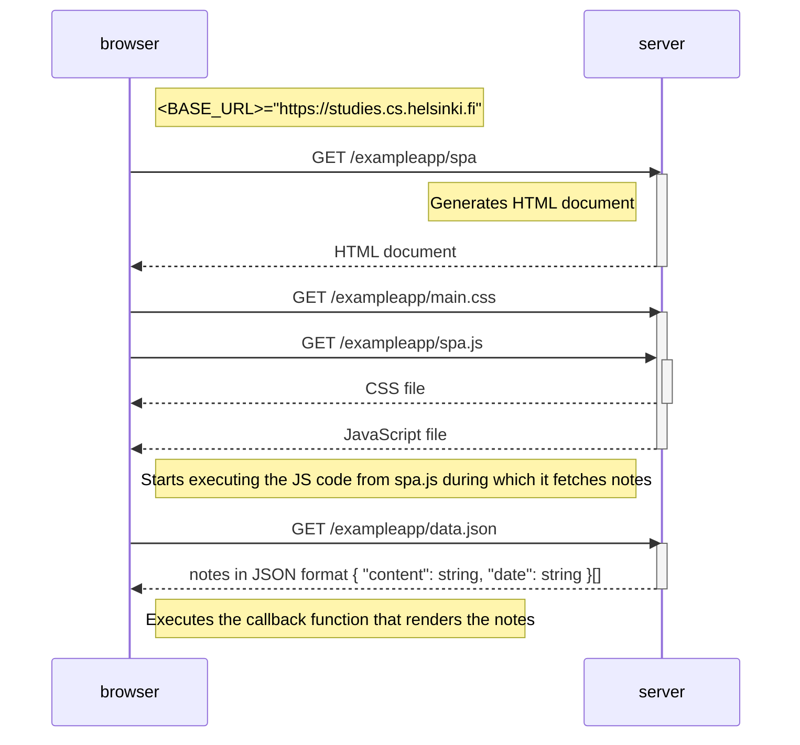

```mermaid
sequenceDiagram
    participant browser
    participant server

    Note right of browser: <BASE_URL>="https://studies.cs.helsinki.fi"

    browser->>server: GET /exampleapp/spa
    activate server
    Note left of server: Generates HTML document
    server-->>browser: HTML document
    deactivate server

    browser->>server: GET /exampleapp/main.css
    activate server
    browser->>server: GET /exampleapp/spa.js
    activate server
    server-->>browser: CSS file
    deactivate server
    server-->>browser: JavaScript file
    deactivate server

    Note right of browser: Starts executing the JS code from spa.js during which it fetches notes

    browser->>server: GET /exampleapp/data.json
    activate server
    server-->>browser: notes in JSON format { "content": string, "date": string }[]
    deactivate server

    Note right of browser: Executes the callback function that renders the notes
```
