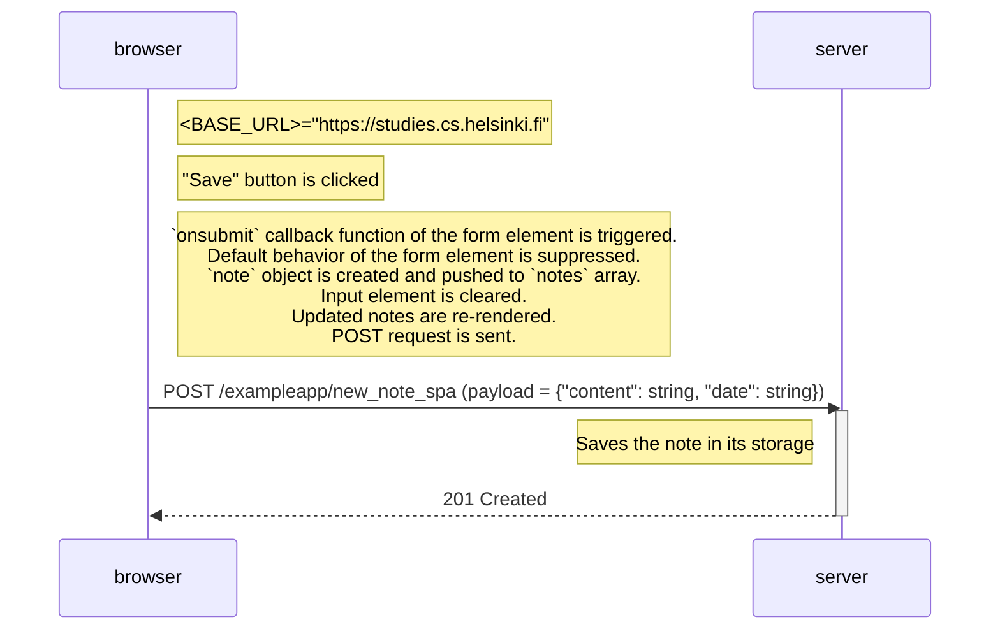

```mermaid
sequenceDiagram
    participant browser
    participant server

    Note right of browser: <BASE_URL>="https://studies.cs.helsinki.fi"

    Note right of browser: "Save" button is clicked
    Note right of browser: `onsubmit` callback function of the form element is triggered.<br>Default behavior of the form element is suppressed.<br>`note` object is created and pushed to `notes` array.<br>Input element is cleared.<br>Updated notes are re-rendered.<br>POST request is sent.

    browser->>server: POST /exampleapp/new_note_spa (payload = {"content": string, "date": string})
    activate server
    Note left of server: Saves the note in its storage
    server-->>browser: 201 Created
    deactivate server
```
